# Data Model

## Entity Relationship Overview

HeadsUp is a goal-first social network where Users create Goals with Phases and Steps, post Updates about their progress, participate in Challenges, and build social connections through Follows, Friendships, and Subscriptions. The platform includes gamification through XP-based leveling and coach-led group goals.

- A **User** has many Goals, GoalPosts, Follows, Friendships, Activities, and can be a Coach
- A **Goal** belongs to a User and a Category, has many Phases, Posts, Reactions, and Subscriptions
- A **GoalPhase** belongs to a Goal and has many Steps
- A **GoalStep** belongs to a Phase and can have related Posts
- A **GoalPost** belongs to a Goal and User, optionally linked to a Step
- A **Challenge** can be predefined (with Phases/Steps) or custom (with Tasks)
- A **GroupGoalTemplate** is a coach-defined template that generates goal instances for participants
- **Reaction** is a polymorphic table for likes/dislikes on goals, posts, and comments
- **Comment** is a polymorphic table for comments on goals and posts
- **UserFollow** tracks follower/following relationships between Users
- **Friendship** tracks friend request/acceptance workflows between Users
- **UserActivity** logs all XP-earning actions for gamification
- **UserLevel** tracks each User's current level and XP

### ER Diagram

```mermaid
erDiagram
    USER ||--o{ GOAL : creates
    USER ||--o{ GOAL_POST : writes
    USER ||--o{ REACTION : creates
    USER ||--o{ COMMENT : writes
    USER ||--o{ GOAL_SUBSCRIPTION : subscribes
    USER ||--o{ USER_FOLLOW : follows
    USER ||--o{ USER_FOLLOW : "is followed"
    USER ||--o{ FRIENDSHIP : "sends request"
    USER ||--o{ FRIENDSHIP : "receives request"
    USER ||--o{ USER_ACTIVITY : performs
    USER ||--|| USER_LEVEL : has
    USER ||--o{ CHALLENGE : creates
    USER ||--o{ CHALLENGE_PARTICIPANT : participates
    USER ||--o{ GROUP_GOAL_TEMPLATE : "coaches"
    USER ||--o{ GROUP_GOAL_ENROLLMENT : enrolls

    CATEGORY ||--o{ GOAL : categorizes
    CATEGORY ||--o{ CHALLENGE : categorizes
    CATEGORY ||--o{ CATEGORY : "parent of"

    GOAL ||--o{ GOAL_PHASE : contains
    GOAL ||--o{ GOAL_POST : has
    GOAL ||--o{ REACTION : receives
    GOAL ||--o{ COMMENT : receives
    GOAL ||--o{ GOAL_SUBSCRIPTION : has

    GOAL_PHASE ||--o{ GOAL_STEP : contains
    GOAL_STEP ||--o{ GOAL_POST : "related to"

    GOAL_POST ||--o{ REACTION : receives
    GOAL_POST ||--o{ COMMENT : receives

    CHALLENGE ||--o{ CHALLENGE_PHASE : contains
    CHALLENGE ||--o{ CHALLENGE_TASK : contains
    CHALLENGE ||--o{ CHALLENGE_PARTICIPANT : has
    CHALLENGE ||--o{ DAILY_CHECK_IN : has
    CHALLENGE ||--o| CHALLENGE : "template for"

    CHALLENGE_PHASE ||--o{ CHALLENGE_STEP : contains

    CHALLENGE_PARTICIPANT ||--o{ DAILY_CHECK_IN : submits

    CHALLENGE_STEP ||--o{ CHALLENGE_STEP_PROGRESS : tracks
    CHALLENGE_TASK ||--o{ CHALLENGE_TASK_COMPLETION : tracks

    CHALLENGE_CATEGORY ||--o{ CHALLENGE : categorizes

    DAILY_CHECK_IN ||--o{ CHECK_IN_LIKE : receives
    DAILY_CHECK_IN ||--o{ CHECK_IN_COMMENT : receives
    DAILY_CHECK_IN ||--o{ REACTION : receives
    DAILY_CHECK_IN ||--o{ COMMENT : receives

    GROUP_GOAL_TEMPLATE ||--o{ TEMPLATE_PHASE : contains
    GROUP_GOAL_TEMPLATE ||--o{ GROUP_GOAL_ENROLLMENT : has

    TEMPLATE_PHASE ||--o{ TEMPLATE_STEP : contains

    USER {
        bigint id PK
        citext email UK
        varchar user_name UK
        varchar name
        varchar bio
        varchar about
        integer level
        varchar image_path
        integer goal_amount
        varchar hashed_password
        utc_datetime confirmed_at
        varchar role
        varchar subscription_type
        varchar privacy
        integer xp
        utc_datetime inserted_at
        utc_datetime updated_at
    }

    CATEGORY {
        bigint id PK
        varchar name
        text description
        varchar icon_url
        varchar image_path
        boolean is_active
        bigint parent_id FK
        utc_datetime inserted_at
        utc_datetime updated_at
    }

    GOAL {
        bigint id PK
        varchar title
        text description
        text big_description
        varchar status
        varchar privacy
        utc_datetime target_date
        integer progress
        varchar image_path
        text failure_reason
        utc_datetime failed_at
        utc_datetime deleted_at
        boolean is_frozen
        bigint category_id FK
        bigint user_id FK
        bigint template_enrollment_id FK
        utc_datetime inserted_at
        utc_datetime updated_at
    }

    GOAL_PHASE {
        bigint id PK
        varchar title
        integer order_index
        bigint goal_id FK
        utc_datetime inserted_at
        utc_datetime updated_at
    }

    GOAL_STEP {
        bigint id PK
        varchar title
        text description
        integer order_index
        boolean is_completed
        utc_datetime completed_at
        bigint phase_id FK
        utc_datetime inserted_at
        utc_datetime updated_at
    }

    GOAL_POST {
        bigint id PK
        text content
        varchar post_type
        varchar media_url
        bigint goal_id FK
        bigint user_id FK
        bigint step_id FK
        utc_datetime inserted_at
        utc_datetime updated_at
    }

    REACTION {
        bigint id PK
        bigint user_id FK
        varchar target_type
        bigint target_id
        varchar reaction_type
        utc_datetime inserted_at
    }

    COMMENT {
        bigint id PK
        bigint user_id FK
        varchar target_type
        bigint target_id
        text content
        utc_datetime inserted_at
        utc_datetime updated_at
    }

    GOAL_SUBSCRIPTION {
        bigint id PK
        bigint goal_id FK
        bigint user_id FK
        utc_datetime inserted_at
        utc_datetime updated_at
    }

    CHALLENGE {
        bigint id PK
        bigint creator_user_id FK
        varchar type
        varchar title
        text description
        bigint category_id FK
        varchar visibility
        varchar status
        boolean is_template
        bigint template_id FK
        integer duration_days
        date start_date
        date end_date
        text failure_reason
        utc_datetime failed_at
        utc_datetime inserted_at
        utc_datetime updated_at
    }

    CHALLENGE_PHASE {
        bigint id PK
        varchar title
        integer order_index
        bigint challenge_id FK
        utc_datetime inserted_at
        utc_datetime updated_at
    }

    CHALLENGE_STEP {
        bigint id PK
        varchar title
        text description
        integer order_index
        bigint phase_id FK
        utc_datetime inserted_at
        utc_datetime updated_at
    }

    CHALLENGE_TASK {
        bigint id PK
        varchar title
        text description
        varchar schedule_type
        array schedule_weekdays
        bigint challenge_id FK
        utc_datetime inserted_at
        utc_datetime updated_at
    }

    CHALLENGE_PARTICIPANT {
        bigint id PK
        bigint challenge_id FK
        bigint user_id FK
        varchar status
        date start_date
        date end_date
        text failure_reason
        utc_datetime failed_at
        utc_datetime joined_at
        utc_datetime completed_at
    }

    DAILY_CHECK_IN {
        bigint id PK
        bigint participant_id FK
        bigint challenge_id FK
        bigint user_id FK
        integer day_number
        date completed_date
        integer total_tasks
        integer completed_tasks
        integer failed_tasks
        integer skipped_tasks
        text note
        utc_datetime inserted_at
        utc_datetime updated_at
    }

    GROUP_GOAL_TEMPLATE {
        bigint id PK
        bigint coach_user_id FK
        varchar title
        text description
        bigint category_id FK
        varchar status
        utc_datetime inserted_at
        utc_datetime updated_at
    }

    TEMPLATE_PHASE {
        bigint id PK
        varchar title
        integer order_index
        bigint template_id FK
        utc_datetime inserted_at
        utc_datetime updated_at
    }

    TEMPLATE_STEP {
        bigint id PK
        varchar title
        text description
        integer order_index
        bigint phase_id FK
        utc_datetime inserted_at
        utc_datetime updated_at
    }

    GROUP_GOAL_ENROLLMENT {
        bigint id PK
        bigint template_id FK
        bigint participant_user_id FK
        bigint participant_goal_id FK
        utc_datetime enrolled_at
        utc_datetime started_at
    }

    USER_FOLLOW {
        bigint id PK
        bigint follower_id FK
        bigint following_id FK
        utc_datetime inserted_at
        utc_datetime updated_at
    }

    FRIENDSHIP {
        bigint id PK
        bigint user_id FK
        bigint friend_id FK
        varchar status
        timestamp inserted_at
        timestamp updated_at
    }

    USER_LEVEL {
        bigint id PK
        integer level
        integer xp
        varchar level_name
        bigint user_id FK
        utc_datetime inserted_at
        utc_datetime updated_at
    }

    USER_ACTIVITY {
        bigint id PK
        varchar activity_type
        integer xp_change
        text description
        map metadata
        bigint user_id FK
        bigint goal_id FK
        bigint post_id FK
        bigint reaction_id
        bigint follow_id
        utc_datetime inserted_at
    }

    USERS_TOKEN {
        bigint id PK
        bigint user_id FK
        binary token
        varchar context
        varchar sent_to
        utc_datetime inserted_at
    }

    CHALLENGE_CATEGORY {
        bigint id PK
        varchar name
        varchar description
        varchar image_path
        utc_datetime inserted_at
        utc_datetime updated_at
    }

    CHALLENGE_STEP_PROGRESS {
        bigint id PK
        bigint challenge_step_id FK
        bigint user_id FK
        bigint challenge_id FK
        varchar status
        utc_datetime completed_at
        utc_datetime inserted_at
        utc_datetime updated_at
    }

    CHALLENGE_TASK_COMPLETION {
        bigint id PK
        bigint challenge_task_id FK
        bigint user_id FK
        bigint challenge_id FK
        varchar status
        date completed_date
        utc_datetime inserted_at
        utc_datetime updated_at
    }

    CHECK_IN_LIKE {
        bigint id PK
        bigint daily_check_in_id FK
        bigint user_id FK
        varchar like_type
        utc_datetime inserted_at
        utc_datetime updated_at
    }

    CHECK_IN_COMMENT {
        bigint id PK
        bigint daily_check_in_id FK
        bigint user_id FK
        text content
        utc_datetime inserted_at
        utc_datetime updated_at
    }
```



---

## Enum Definitions

```yaml
enums:
  user_role:
    values: [guest, user, coach, admin]
    default: user
    description: User permission level

  user_privacy:
    values: [public, private, friends_only]
    default: public
    description: User profile visibility setting

  subscription_type:
    values: [free, pro_3, pro_5, unlimited]
    default: free
    description: User subscription tier (affects active goal limit)

  goal_status:
    values: [active, frozen, completed, failed]
    default: active
    description: Current state of a goal

  goal_privacy:
    values: [public, private, friends]
    default: public
    description: Goal visibility setting

  post_type:
    values: [update, milestone, achievement, challenge, motivation]
    description: Type of goal post for categorization

  friendship_status:
    values: [pending, accepted, declined, blocked]
    default: pending
    description: State of a friend request

  challenge_type:
    values: [predefined, custom]
    description: Whether challenge is admin-created template or user-created

  challenge_visibility:
    values: [public, friends, private]
    default: public
    description: Who can see and join the challenge

  challenge_status:
    values: [active, completed, paused, cancelled, failed]
    default: active
    description: Current state of a challenge

  schedule_type:
    values: [daily, twice_week, every_other_day, mon_fri, custom_weekdays]
    description: Recurrence pattern for custom challenge tasks

  reaction_type:
    values: [like, dislike]
    default: like
    description: Type of reaction on content

  target_type:
    values: [goal, post, comment, daily_check_in]
    description: Polymorphic target for reactions and comments

  template_status:
    values: [draft, active, archived]
    default: draft
    description: State of a group goal template

  participant_status:
    values: [enrolled, active, completed, dropped, failed]
    default: enrolled
    description: State of challenge/template participation

  activity_type:
    values:
      - goal_created
      - goal_completed
      - goal_failed
      - goal_frozen
      - goal_deleted
      - goal_updated
      - phase_completed
      - step_completed
      - post_created
      - post_liked
      - post_received_like
      - comment_created
      - user_followed
      - user_received_follow
      - friend_request_sent
      - friend_request_accepted
      - daily_login
      - challenge_joined
      - challenge_completed
      - challenge_failed
      - daily_check_in_submitted
    description: Types of user activities that earn XP
```

---

## Entities

### Entity: User

**Description:** A registered account in the system. Users can create goals, follow other users, send friend requests, participate in challenges, and engage with the gamification system. Coaches can create group goal templates.

```yaml
table: users
columns:
  - name: id
    type: BIGINT
    primary_key: true
    auto_increment: true

  - name: email
    type: CITEXT
    required: false
    unique: true
    notes: Case-insensitive email using PostgreSQL citext extension

  - name: user_name
    type: VARCHAR(255)
    required: true
    unique: true
    notes: Unique username, 3-20 chars, alphanumeric + underscores only

  - name: name
    type: VARCHAR(255)
    required: true
    notes: Display name

  - name: bio
    type: VARCHAR(255)
    required: false
    notes: Short biography

  - name: about
    type: TEXT
    required: false
    notes: Extended about section

  - name: level
    type: INTEGER
    required: false
    default: 1
    notes: Current user level (1-10)

  - name: image_path
    type: VARCHAR(255)
    required: false
    notes: Path to avatar image (avatar_url)

  - name: goal_amount
    type: INTEGER
    required: false
    default: 0
    notes: Count of user's goals

  - name: hashed_password
    type: VARCHAR(255)
    required: false
    notes: Bcrypt hashed password

  - name: confirmed_at
    type: TIMESTAMPTZ
    required: false
    notes: Email confirmation timestamp

  - name: role
    type: VARCHAR(255)
    required: true
    default: "'user'"
    notes: "Enum: guest, user, coach, admin"

  - name: subscription_type
    type: VARCHAR(255)
    required: false
    default: "'free'"
    notes: "Enum: free, pro_3, pro_5, unlimited"

  - name: privacy
    type: VARCHAR(255)
    required: false
    default: "'public'"
    notes: "Enum: public, private, friends_only"

  - name: xp
    type: INTEGER
    required: false
    default: 0
    notes: Experience points for gamification

  - name: inserted_at
    type: TIMESTAMPTZ
    required: true
    default: now()

  - name: updated_at
    type: TIMESTAMPTZ
    required: true
    default: now()

indexes:
  - columns: [email]
    type: btree
    unique: true

  - columns: [user_name]
    type: btree
    unique: true

  - columns: [role]
    type: btree
    unique: false

  - columns: [privacy]
    type: btree
    unique: false

  - columns: [xp]
    type: btree
    unique: false

constraints:
  - type: check
    column: user_name
    expression: "length(user_name) >= 3 AND length(user_name) <= 20"
    notes: Validated at application level

relationships:
  - has_many: goals (via goals.user_id)
  - has_many: goal_posts (via goal_posts.user_id)
  - has_many: reactions (via reactions.user_id)
  - has_many: comments (via comments.user_id)
  - has_many: goal_subscriptions (via goal_subscriptions.user_id)
  - has_many: follower_relationships (via user_follows.following_id)
  - has_many: following_relationships (via user_follows.follower_id)
  - has_many: sent_friend_requests (via friendships.user_id)
  - has_many: received_friend_requests (via friendships.friend_id)
  - has_many: user_activities (via user_activities.user_id)
  - has_one: user_level (via user_levels.user_id)
  - has_many: challenges (via challenges.creator_user_id)
  - has_many: challenge_participations (via challenge_participants.user_id)
  - has_many: coached_templates (via group_goal_templates.coach_user_id)
  - has_many: template_enrollments (via group_goal_enrollments.participant_user_id)
```

---

### Entity: Category

**Description:** Admin-managed classification for goals and challenges. Supports hierarchical structure with parent_id for subcategories.

```yaml
table: categories
columns:
  - name: id
    type: BIGINT
    primary_key: true
    auto_increment: true

  - name: name
    type: VARCHAR(255)
    required: true

  - name: description
    type: TEXT
    required: false

  - name: icon_url
    type: VARCHAR(255)
    required: false
    notes: Icon for the category

  - name: image_path
    type: VARCHAR(255)
    required: false
    notes: Cover image for the category

  - name: is_active
    type: BOOLEAN
    required: true
    default: true

  - name: parent_id
    type: BIGINT
    required: false
    references: categories.id
    on_delete: CASCADE
    notes: For hierarchical categories

  - name: inserted_at
    type: TIMESTAMPTZ
    required: true
    default: now()

  - name: updated_at
    type: TIMESTAMPTZ
    required: true
    default: now()

indexes:
  - columns: [parent_id]
    type: btree
    unique: false

  - columns: [is_active]
    type: btree
    unique: false

relationships:
  - has_many: goals (via goals.category_id)
  - has_many: challenges (via challenges.category_id)
  - has_many: children (via categories.parent_id)
  - belongs_to: parent (via parent_id)
```

---

### Entity: Goal

**Description:** A user's goal with structured phases and steps. Goals can be public, private, or friends-only. Supports frozen states and failure tracking. Can be generated from a group goal template.

```yaml
table: goals
columns:
  - name: id
    type: BIGINT
    primary_key: true
    auto_increment: true

  - name: title
    type: VARCHAR(255)
    required: true

  - name: description
    type: TEXT
    required: false
    notes: Short description

  - name: big_description
    type: TEXT
    required: false
    notes: Extended description/plan

  - name: status
    type: VARCHAR(255)
    required: true
    default: "'active'"
    notes: "Enum: active, frozen, completed, failed"

  - name: privacy
    type: VARCHAR(255)
    required: true
    default: "'public'"
    notes: "Enum: public, private, friends"

  - name: target_date
    type: TIMESTAMPTZ
    required: false
    notes: Goal completion target date (due_date)

  - name: progress
    type: INTEGER
    required: false
    default: 0
    notes: Progress percentage (0-100)

  - name: image_path
    type: VARCHAR(255)
    required: false
    notes: Goal cover image (image_url)

  - name: failure_reason
    type: TEXT
    required: false
    notes: Required when status is failed

  - name: failed_at
    type: TIMESTAMPTZ
    required: false
    notes: Timestamp when goal was marked failed

  - name: deleted_at
    type: TIMESTAMPTZ
    required: false
    notes: Soft delete timestamp

  - name: is_frozen
    type: BOOLEAN
    required: false
    default: false
    notes: Whether goal is temporarily frozen

  - name: category_id
    type: BIGINT
    required: false
    references: categories.id
    on_delete: SET NULL

  - name: user_id
    type: BIGINT
    required: true
    references: users.id
    on_delete: CASCADE
    notes: Owner of the goal

  - name: template_enrollment_id
    type: BIGINT
    required: false
    references: group_goal_enrollments.id
    on_delete: SET NULL
    notes: If goal was generated from a template

  - name: inserted_at
    type: TIMESTAMPTZ
    required: true
    default: now()

  - name: updated_at
    type: TIMESTAMPTZ
    required: true
    default: now()

indexes:
  - columns: [category_id]
    type: btree
    unique: false

  - columns: [user_id]
    type: btree
    unique: false

  - columns: [status]
    type: btree
    unique: false

  - columns: [privacy]
    type: btree
    unique: false

  - columns: [deleted_at]
    type: btree
    unique: false
    notes: For soft delete queries

  - columns: [is_frozen]
    type: btree
    unique: false

constraints:
  - type: check
    column: progress
    expression: "progress >= 0 AND progress <= 100"
    notes: Validated at application level

relationships:
  - belongs_to: user (via user_id)
  - belongs_to: category (via category_id)
  - belongs_to: template_enrollment (via template_enrollment_id)
  - has_many: goal_phases (via goal_phases.goal_id)
  - has_many: goal_posts (via goal_posts.goal_id)
  - has_many: reactions (via reactions where target_type='goal')
  - has_many: comments (via comments where target_type='goal')
  - has_many: goal_subscriptions (via goal_subscriptions.goal_id)
```

---

### Entity: GoalPhase

**Description:** A phase/milestone within a goal. Goals are broken into phases, and phases contain steps. Phases are ordered.

```yaml
table: goal_phases
columns:
  - name: id
    type: BIGINT
    primary_key: true
    auto_increment: true

  - name: title
    type: VARCHAR(255)
    required: true

  - name: order_index
    type: INTEGER
    required: true
    notes: Display order within goal

  - name: goal_id
    type: BIGINT
    required: true
    references: goals.id
    on_delete: CASCADE

  - name: inserted_at
    type: TIMESTAMPTZ
    required: true
    default: now()

  - name: updated_at
    type: TIMESTAMPTZ
    required: true
    default: now()

indexes:
  - columns: [goal_id]
    type: btree
    unique: false

  - columns: [goal_id, order_index]
    type: btree
    unique: false
    notes: For ordered retrieval

relationships:
  - belongs_to: goal (via goal_id)
  - has_many: goal_steps (via goal_steps.phase_id)
```

---

### Entity: GoalStep

**Description:** Individual steps within a goal phase. Steps are ordered and can be marked as completed. Maximum 20 steps per phase (enforced at application level).

```yaml
table: goal_steps
columns:
  - name: id
    type: BIGINT
    primary_key: true
    auto_increment: true

  - name: title
    type: VARCHAR(255)
    required: true

  - name: description
    type: TEXT
    required: false

  - name: order_index
    type: INTEGER
    required: true
    notes: Display order within phase

  - name: is_completed
    type: BOOLEAN
    required: true
    default: false

  - name: completed_at
    type: TIMESTAMPTZ
    required: false
    notes: When the step was completed

  - name: phase_id
    type: BIGINT
    required: true
    references: goal_phases.id
    on_delete: CASCADE

  - name: inserted_at
    type: TIMESTAMPTZ
    required: true
    default: now()

  - name: updated_at
    type: TIMESTAMPTZ
    required: true
    default: now()

indexes:
  - columns: [phase_id]
    type: btree
    unique: false

  - columns: [phase_id, order_index]
    type: btree
    unique: false
    notes: For ordered retrieval

  - columns: [is_completed]
    type: btree
    unique: false

relationships:
  - belongs_to: phase (via phase_id)
  - has_many: goal_posts (via goal_posts.step_id)
```

---

### Entity: GoalPost

**Description:** Progress updates inside a goal feed. Can be linked to a specific step or the goal overall.

```yaml
table: goal_posts
columns:
  - name: id
    type: BIGINT
    primary_key: true
    auto_increment: true

  - name: content
    type: TEXT
    required: false
    notes: Post text content (content_text)

  - name: post_type
    type: VARCHAR(255)
    required: false
    notes: "Enum: update, milestone, achievement, challenge, motivation"

  - name: media_url
    type: VARCHAR(255)
    required: false
    notes: Optional post image/media

  - name: goal_id
    type: BIGINT
    required: true
    references: goals.id
    on_delete: CASCADE

  - name: user_id
    type: BIGINT
    required: true
    references: users.id
    on_delete: CASCADE
    notes: Author of the post

  - name: step_id
    type: BIGINT
    required: false
    references: goal_steps.id
    on_delete: SET NULL
    notes: Optional link to specific step

  - name: inserted_at
    type: TIMESTAMPTZ
    required: true
    default: now()

  - name: updated_at
    type: TIMESTAMPTZ
    required: true
    default: now()

indexes:
  - columns: [goal_id]
    type: btree
    unique: false

  - columns: [user_id]
    type: btree
    unique: false

  - columns: [step_id]
    type: btree
    unique: false

  - columns: [goal_id, inserted_at]
    type: btree
    unique: false
    notes: For chronological feed

relationships:
  - belongs_to: goal (via goal_id)
  - belongs_to: user (via user_id)
  - belongs_to: step (via step_id)
  - has_many: reactions (via reactions where target_type='post')
  - has_many: comments (via comments where target_type='post')
```

---

### Entity: Reaction

**Description:** Polymorphic table for likes/dislikes on goals, posts, and comments. Users cannot react to their own content (enforced at application level).

```yaml
table: reactions
columns:
  - name: id
    type: BIGINT
    primary_key: true
    auto_increment: true

  - name: user_id
    type: BIGINT
    required: true
    references: users.id
    on_delete: CASCADE

  - name: target_type
    type: VARCHAR(255)
    required: true
    notes: "Enum: goal, post, comment"

  - name: target_id
    type: BIGINT
    required: true
    notes: ID of the goal, post, or comment

  - name: reaction_type
    type: VARCHAR(255)
    required: true
    default: "'like'"
    notes: "Enum: like, dislike"

  - name: inserted_at
    type: TIMESTAMPTZ
    required: true
    default: now()

indexes:
  - columns: [user_id, target_type, target_id]
    type: btree
    unique: true
    notes: Prevents duplicate reactions

  - columns: [target_type, target_id]
    type: btree
    unique: false
    notes: For counting reactions on content

  - columns: [user_id]
    type: btree
    unique: false

relationships:
  - belongs_to: user (via user_id)
```

---

### Entity: Comment

**Description:** Polymorphic table for comments on goals and posts.

```yaml
table: comments
columns:
  - name: id
    type: BIGINT
    primary_key: true
    auto_increment: true

  - name: user_id
    type: BIGINT
    required: true
    references: users.id
    on_delete: CASCADE

  - name: target_type
    type: VARCHAR(255)
    required: true
    notes: "Enum: goal, post"

  - name: target_id
    type: BIGINT
    required: true
    notes: ID of the goal or post

  - name: content
    type: TEXT
    required: true

  - name: inserted_at
    type: TIMESTAMPTZ
    required: true
    default: now()

  - name: updated_at
    type: TIMESTAMPTZ
    required: true
    default: now()

indexes:
  - columns: [target_type, target_id]
    type: btree
    unique: false
    notes: For fetching comments on content

  - columns: [user_id]
    type: btree
    unique: false

  - columns: [target_type, target_id, inserted_at]
    type: btree
    unique: false
    notes: For chronological comment feed

relationships:
  - belongs_to: user (via user_id)
  - has_many: reactions (via reactions where target_type='comment')
```

---

### Entity: GoalSubscription

**Description:** Join table tracking which users are subscribed to (following) which goals. Users cannot subscribe to their own goals.

```yaml
table: goal_subscriptions
columns:
  - name: id
    type: BIGINT
    primary_key: true
    auto_increment: true

  - name: goal_id
    type: BIGINT
    required: true
    references: goals.id
    on_delete: CASCADE

  - name: user_id
    type: BIGINT
    required: true
    references: users.id
    on_delete: CASCADE

  - name: inserted_at
    type: TIMESTAMPTZ
    required: true
    default: now()

  - name: updated_at
    type: TIMESTAMPTZ
    required: true
    default: now()

indexes:
  - columns: [goal_id, user_id]
    type: btree
    unique: true
    notes: Prevents duplicate subscriptions

  - columns: [goal_id]
    type: btree
    unique: false

  - columns: [user_id]
    type: btree
    unique: false

relationships:
  - belongs_to: goal (via goal_id)
  - belongs_to: user (via user_id)
```

---

### Entity: Challenge

**Description:** Challenges can be predefined (admin-created with phases/steps) or custom (user-created with scheduled tasks). Challenges exist as either templates (is_template=true) or personal challenges (is_template=false). Templates are read-only blueprints; personal challenges are solo instances created from templates with their own progress tracking, daily check-ins, and feed.

```yaml
table: challenges
columns:
  - name: id
    type: BIGINT
    primary_key: true
    auto_increment: true

  - name: creator_user_id
    type: BIGINT
    required: true
    references: users.id
    on_delete: CASCADE
    notes: Admin for predefined, user for custom

  - name: type
    type: VARCHAR(255)
    required: true
    notes: "Enum: predefined, custom"

  - name: title
    type: VARCHAR(255)
    required: true

  - name: description
    type: TEXT
    required: false

  - name: category_id
    type: BIGINT
    required: false
    references: categories.id
    on_delete: SET NULL

  - name: visibility
    type: VARCHAR(255)
    required: true
    default: "'public'"
    notes: "Enum: public, friends, private"

  - name: status
    type: VARCHAR(255)
    required: true
    default: "'active'"
    notes: "Enum: active, completed, paused, cancelled, failed"

  - name: is_template
    type: BOOLEAN
    required: true
    default: false
    notes: True for templates (blueprints), false for personal challenges

  - name: template_id
    type: BIGINT
    required: false
    references: challenges.id
    on_delete: SET NULL
    notes: References parent template for personal challenges

  - name: duration_days
    type: INTEGER
    required: false
    notes: Duration in days for predefined templates

  - name: start_date
    type: DATE
    required: false
    notes: Start date for personal/custom challenges

  - name: end_date
    type: DATE
    required: false
    notes: End date for personal/custom challenges

  - name: failure_reason
    type: TEXT
    required: false
    notes: Optional reason when challenge status is failed

  - name: failed_at
    type: TIMESTAMPTZ
    required: false
    notes: Timestamp when challenge was marked failed

  - name: inserted_at
    type: TIMESTAMPTZ
    required: true
    default: now()

  - name: updated_at
    type: TIMESTAMPTZ
    required: true
    default: now()

indexes:
  - columns: [creator_user_id]
    type: btree
    unique: false

  - columns: [type]
    type: btree
    unique: false

  - columns: [category_id]
    type: btree
    unique: false

  - columns: [visibility]
    type: btree
    unique: false

  - columns: [is_template]
    type: btree
    unique: false

  - columns: [template_id]
    type: btree
    unique: false
    notes: For finding derived challenges from a template

  - columns: [status]
    type: btree
    unique: false

relationships:
  - belongs_to: creator (via creator_user_id -> users.id)
  - belongs_to: category (via category_id)
  - belongs_to: template (via template_id -> challenges.id)
  - has_many: derived_challenges (via challenges.template_id, self-referential)
  - has_many: challenge_phases (via challenge_phases.challenge_id)
  - has_many: challenge_tasks (via challenge_tasks.challenge_id)
  - has_many: challenge_participants (via challenge_participants.challenge_id)
  - has_many: daily_check_ins (via daily_check_ins.challenge_id)
```

---

### Entity: ChallengePhase

**Description:** Phases within a predefined challenge. Same pattern as GoalPhase.

```yaml
table: challenge_phases
columns:
  - name: id
    type: BIGINT
    primary_key: true
    auto_increment: true

  - name: title
    type: VARCHAR(255)
    required: true

  - name: order_index
    type: INTEGER
    required: true
    notes: Display order within challenge

  - name: challenge_id
    type: BIGINT
    required: true
    references: challenges.id
    on_delete: CASCADE

  - name: inserted_at
    type: TIMESTAMPTZ
    required: true
    default: now()

  - name: updated_at
    type: TIMESTAMPTZ
    required: true
    default: now()

indexes:
  - columns: [challenge_id]
    type: btree
    unique: false

  - columns: [challenge_id, order_index]
    type: btree
    unique: false

relationships:
  - belongs_to: challenge (via challenge_id)
  - has_many: challenge_steps (via challenge_steps.phase_id)
```

---

### Entity: ChallengeStep

**Description:** Steps within a challenge phase. Same pattern as GoalStep.

```yaml
table: challenge_steps
columns:
  - name: id
    type: BIGINT
    primary_key: true
    auto_increment: true

  - name: title
    type: VARCHAR(255)
    required: true

  - name: description
    type: TEXT
    required: false

  - name: order_index
    type: INTEGER
    required: true
    notes: Display order within phase

  - name: phase_id
    type: BIGINT
    required: true
    references: challenge_phases.id
    on_delete: CASCADE

  - name: inserted_at
    type: TIMESTAMPTZ
    required: true
    default: now()

  - name: updated_at
    type: TIMESTAMPTZ
    required: true
    default: now()

indexes:
  - columns: [phase_id]
    type: btree
    unique: false

  - columns: [phase_id, order_index]
    type: btree
    unique: false

relationships:
  - belongs_to: phase (via phase_id)
```

---

### Entity: ChallengeTask

**Description:** Scheduled tasks for custom challenges. Tasks have recurrence patterns (daily, twice a week, custom weekdays, etc.).

```yaml
table: challenge_tasks
columns:
  - name: id
    type: BIGINT
    primary_key: true
    auto_increment: true

  - name: title
    type: VARCHAR(255)
    required: true

  - name: description
    type: TEXT
    required: false

  - name: schedule_type
    type: VARCHAR(255)
    required: true
    notes: "Enum: daily, twice_week, every_other_day, mon_fri, custom_weekdays"

  - name: schedule_weekdays
    type: VARCHAR(255)[]
    required: false
    notes: "Array e.g. ['mon', 'wed', 'fri'] for custom_weekdays"

  - name: challenge_id
    type: BIGINT
    required: true
    references: challenges.id
    on_delete: CASCADE

  - name: inserted_at
    type: TIMESTAMPTZ
    required: true
    default: now()

  - name: updated_at
    type: TIMESTAMPTZ
    required: true
    default: now()

indexes:
  - columns: [challenge_id]
    type: btree
    unique: false

relationships:
  - belongs_to: challenge (via challenge_id)
```

---

### Entity: ChallengeParticipant

**Description:** Tracks which users are participating in which challenges. For personal challenges, there is exactly one participant (the owner).

```yaml
table: challenge_participants
columns:
  - name: id
    type: BIGINT
    primary_key: true
    auto_increment: true

  - name: challenge_id
    type: BIGINT
    required: true
    references: challenges.id
    on_delete: CASCADE

  - name: user_id
    type: BIGINT
    required: true
    references: users.id
    on_delete: CASCADE

  - name: status
    type: VARCHAR(255)
    required: true
    default: "'enrolled'"
    notes: "Enum: enrolled, active, completed, dropped, failed"

  - name: start_date
    type: DATE
    required: false
    notes: Participant's personal start date

  - name: end_date
    type: DATE
    required: false
    notes: Participant's personal end date

  - name: failure_reason
    type: TEXT
    required: false
    notes: Optional reason when participant status is failed

  - name: failed_at
    type: TIMESTAMPTZ
    required: false
    notes: Timestamp when participant failed the challenge

  - name: joined_at
    type: TIMESTAMPTZ
    required: true
    default: now()

  - name: completed_at
    type: TIMESTAMPTZ
    required: false
    notes: When the user completed the challenge

indexes:
  - columns: [challenge_id, user_id]
    type: btree
    unique: true
    notes: Prevents duplicate participation

  - columns: [challenge_id]
    type: btree
    unique: false

  - columns: [user_id]
    type: btree
    unique: false

  - columns: [status]
    type: btree
    unique: false

relationships:
  - belongs_to: challenge (via challenge_id)
  - belongs_to: user (via user_id)
  - has_many: daily_check_ins (via daily_check_ins.participant_id)
```

---

### Entity: DailyCheckIn

**Description:** Records a user's daily check-in for a personal challenge. Each check-in captures the day number, task completion summary, and optional reflection note. Daily check-ins serve as feed posts in the challenge feed and support comments and reactions via the polymorphic tables.

```yaml
table: daily_check_ins
columns:
  - name: id
    type: BIGINT
    primary_key: true
    auto_increment: true

  - name: participant_id
    type: BIGINT
    required: true
    references: challenge_participants.id
    on_delete: CASCADE
    notes: The participant who submitted the check-in

  - name: challenge_id
    type: BIGINT
    required: true
    references: challenges.id
    on_delete: CASCADE
    notes: Denormalized for efficient feed queries

  - name: user_id
    type: BIGINT
    required: true
    references: users.id
    on_delete: CASCADE
    notes: Denormalized for user activity queries

  - name: day_number
    type: INTEGER
    required: true
    notes: "Which day of the challenge (1-based: day 1 = start_date)"

  - name: completed_date
    type: DATE
    required: true
    notes: The calendar date of this check-in

  - name: total_tasks
    type: INTEGER
    required: true
    default: 0
    notes: Total tasks scheduled for this day

  - name: completed_tasks
    type: INTEGER
    required: true
    default: 0
    notes: Tasks marked as done

  - name: failed_tasks
    type: INTEGER
    required: true
    default: 0
    notes: Tasks marked as failed

  - name: skipped_tasks
    type: INTEGER
    required: true
    default: 0
    notes: Tasks not addressed

  - name: note
    type: TEXT
    required: false
    notes: Optional user reflection about the day

  - name: inserted_at
    type: TIMESTAMPTZ
    required: true
    default: now()

  - name: updated_at
    type: TIMESTAMPTZ
    required: true
    default: now()

indexes:
  - columns: [participant_id, completed_date]
    type: btree
    unique: true
    notes: One check-in per participant per day

  - columns: [challenge_id, inserted_at]
    type: btree
    unique: false
    notes: For challenge feed queries (newest first)

  - columns: [user_id, inserted_at]
    type: btree
    unique: false
    notes: For user activity feed queries

relationships:
  - belongs_to: participant (via participant_id -> challenge_participants.id)
  - belongs_to: challenge (via challenge_id)
  - belongs_to: user (via user_id)
  - has_many: reactions (via reactions where target_type='daily_check_in')
  - has_many: comments (via comments where target_type='daily_check_in')
```

---

### Entity: GroupGoalTemplate

**Description:** Coach-defined goal template that can be assigned to multiple participants. Each participant gets their own goal instance generated from the template.

```yaml
table: group_goal_templates
columns:
  - name: id
    type: BIGINT
    primary_key: true
    auto_increment: true

  - name: coach_user_id
    type: BIGINT
    required: true
    references: users.id
    on_delete: CASCADE
    notes: Must be a user with coach role

  - name: title
    type: VARCHAR(255)
    required: true

  - name: description
    type: TEXT
    required: false

  - name: category_id
    type: BIGINT
    required: false
    references: categories.id
    on_delete: SET NULL

  - name: status
    type: VARCHAR(255)
    required: true
    default: "'draft'"
    notes: "Enum: draft, active, archived"

  - name: inserted_at
    type: TIMESTAMPTZ
    required: true
    default: now()

  - name: updated_at
    type: TIMESTAMPTZ
    required: true
    default: now()

indexes:
  - columns: [coach_user_id]
    type: btree
    unique: false

  - columns: [category_id]
    type: btree
    unique: false

  - columns: [status]
    type: btree
    unique: false

relationships:
  - belongs_to: coach (via coach_user_id -> users.id)
  - belongs_to: category (via category_id)
  - has_many: template_phases (via template_phases.template_id)
  - has_many: enrollments (via group_goal_enrollments.template_id)
```

---

### Entity: TemplatePhase

**Description:** Phases within a group goal template. When a participant enrolls, these are copied to create GoalPhases.

```yaml
table: template_phases
columns:
  - name: id
    type: BIGINT
    primary_key: true
    auto_increment: true

  - name: title
    type: VARCHAR(255)
    required: true

  - name: order_index
    type: INTEGER
    required: true
    notes: Display order within template

  - name: template_id
    type: BIGINT
    required: true
    references: group_goal_templates.id
    on_delete: CASCADE

  - name: inserted_at
    type: TIMESTAMPTZ
    required: true
    default: now()

  - name: updated_at
    type: TIMESTAMPTZ
    required: true
    default: now()

indexes:
  - columns: [template_id]
    type: btree
    unique: false

  - columns: [template_id, order_index]
    type: btree
    unique: false

relationships:
  - belongs_to: template (via template_id)
  - has_many: template_steps (via template_steps.phase_id)
```

---

### Entity: TemplateStep

**Description:** Steps within a template phase. When a participant enrolls, these are copied to create GoalSteps.

```yaml
table: template_steps
columns:
  - name: id
    type: BIGINT
    primary_key: true
    auto_increment: true

  - name: title
    type: VARCHAR(255)
    required: true

  - name: description
    type: TEXT
    required: false

  - name: order_index
    type: INTEGER
    required: true
    notes: Display order within phase

  - name: phase_id
    type: BIGINT
    required: true
    references: template_phases.id
    on_delete: CASCADE

  - name: inserted_at
    type: TIMESTAMPTZ
    required: true
    default: now()

  - name: updated_at
    type: TIMESTAMPTZ
    required: true
    default: now()

indexes:
  - columns: [phase_id]
    type: btree
    unique: false

  - columns: [phase_id, order_index]
    type: btree
    unique: false

relationships:
  - belongs_to: phase (via phase_id)
```

---

### Entity: GroupGoalEnrollment

**Description:** Tracks participant enrollment in group goal templates. Links to the generated goal instance.

```yaml
table: group_goal_enrollments
columns:
  - name: id
    type: BIGINT
    primary_key: true
    auto_increment: true

  - name: template_id
    type: BIGINT
    required: true
    references: group_goal_templates.id
    on_delete: CASCADE

  - name: participant_user_id
    type: BIGINT
    required: true
    references: users.id
    on_delete: CASCADE

  - name: participant_goal_id
    type: BIGINT
    required: false
    references: goals.id
    on_delete: SET NULL
    notes: Link to generated goal instance

  - name: enrolled_at
    type: TIMESTAMPTZ
    required: true
    default: now()

  - name: started_at
    type: TIMESTAMPTZ
    required: false
    notes: When the participant started the goal

indexes:
  - columns: [template_id, participant_user_id]
    type: btree
    unique: true
    notes: Prevents duplicate enrollment

  - columns: [template_id]
    type: btree
    unique: false

  - columns: [participant_user_id]
    type: btree
    unique: false

  - columns: [participant_goal_id]
    type: btree
    unique: false

relationships:
  - belongs_to: template (via template_id)
  - belongs_to: participant (via participant_user_id -> users.id)
  - belongs_to: participant_goal (via participant_goal_id -> goals.id)
```

---

### Entity: UserFollow

**Description:** Tracks follower/following relationships between users. Users cannot follow themselves. Respects privacy settings.

```yaml
table: user_follows
columns:
  - name: id
    type: BIGINT
    primary_key: true
    auto_increment: true

  - name: follower_id
    type: BIGINT
    required: true
    references: users.id
    on_delete: CASCADE
    notes: The user who is following

  - name: following_id
    type: BIGINT
    required: true
    references: users.id
    on_delete: CASCADE
    notes: The user being followed

  - name: inserted_at
    type: TIMESTAMPTZ
    required: true
    default: now()

  - name: updated_at
    type: TIMESTAMPTZ
    required: true
    default: now()

indexes:
  - columns: [follower_id]
    type: btree
    unique: false

  - columns: [following_id]
    type: btree
    unique: false

  - columns: [follower_id, following_id]
    type: btree
    unique: true
    notes: Prevents duplicate follows

relationships:
  - belongs_to: follower (via follower_id -> users.id)
  - belongs_to: following (via following_id -> users.id)
```

---

### Entity: Friendship

**Description:** Tracks friend request/acceptance workflows. Friendships are bidirectional once accepted. Users cannot friend themselves.

```yaml
table: friendships
columns:
  - name: id
    type: BIGINT
    primary_key: true
    auto_increment: true

  - name: user_id
    type: BIGINT
    required: true
    references: users.id
    on_delete: CASCADE
    notes: The user who sent the request (requester)

  - name: friend_id
    type: BIGINT
    required: true
    references: users.id
    on_delete: CASCADE
    notes: The user receiving the request (receiver)

  - name: status
    type: VARCHAR(255)
    required: true
    default: "'pending'"
    notes: "Enum: pending, accepted, declined, blocked"

  - name: inserted_at
    type: TIMESTAMP
    required: true
    default: now()

  - name: updated_at
    type: TIMESTAMP
    required: true
    default: now()

indexes:
  - columns: [user_id]
    type: btree
    unique: false

  - columns: [friend_id]
    type: btree
    unique: false

  - columns: [status]
    type: btree
    unique: false

  - columns: [user_id, friend_id]
    type: btree
    unique: true
    notes: Prevents duplicate friend requests

relationships:
  - belongs_to: user (via user_id)
  - belongs_to: friend (via friend_id -> users.id)
```

---

### Entity: UserLevel

**Description:** Tracks each user's current gamification level and XP. Ocean-themed level names (Seastar, Crab, etc.).

```yaml
table: user_levels
columns:
  - name: id
    type: BIGINT
    primary_key: true
    auto_increment: true

  - name: level
    type: INTEGER
    required: true
    default: 1
    notes: Current level (1-10)

  - name: xp
    type: INTEGER
    required: true
    default: 0
    notes: Current XP within level

  - name: level_name
    type: VARCHAR(255)
    required: true
    default: "'Seastar'"
    notes: Display name for current level

  - name: user_id
    type: BIGINT
    required: true
    references: users.id
    on_delete: CASCADE

  - name: inserted_at
    type: TIMESTAMPTZ
    required: true
    default: now()

  - name: updated_at
    type: TIMESTAMPTZ
    required: true
    default: now()

indexes:
  - columns: [user_id]
    type: btree
    unique: true

  - columns: [level]
    type: btree
    unique: false

  - columns: [xp]
    type: btree
    unique: false

relationships:
  - belongs_to: user (via user_id)
```

---

### Entity: UserActivity

**Description:** Logs all XP-earning actions for gamification and activity feed. Supports tracking activities related to goals, posts, reactions, and follows.

```yaml
table: user_activities
columns:
  - name: id
    type: BIGINT
    primary_key: true
    auto_increment: true

  - name: activity_type
    type: VARCHAR(255)
    required: true
    notes: Type of activity (see activity_type enum)

  - name: xp_change
    type: INTEGER
    required: true
    default: 0
    notes: XP earned/lost from this activity

  - name: description
    type: TEXT
    required: false
    notes: Human-readable description

  - name: metadata
    type: JSONB
    required: false
    default: "{}"
    notes: Additional activity data

  - name: user_id
    type: BIGINT
    required: true
    references: users.id
    on_delete: CASCADE

  - name: goal_id
    type: BIGINT
    required: false
    references: goals.id
    on_delete: SET NULL
    notes: Related goal if applicable

  - name: post_id
    type: BIGINT
    required: false
    references: goal_posts.id
    on_delete: SET NULL
    notes: Related post if applicable

  - name: reaction_id
    type: BIGINT
    required: false
    notes: Related reaction ID if applicable

  - name: follow_id
    type: BIGINT
    required: false
    notes: Related follow ID if applicable

  - name: inserted_at
    type: TIMESTAMPTZ
    required: true
    default: now()
    notes: No updated_at - activities are immutable

indexes:
  - columns: [user_id]
    type: btree
    unique: false

  - columns: [activity_type]
    type: btree
    unique: false

  - columns: [inserted_at]
    type: btree
    unique: false

  - columns: [user_id, inserted_at]
    type: btree
    unique: false
    notes: For user activity feed queries

relationships:
  - belongs_to: user (via user_id)
  - belongs_to: goal (via goal_id)
  - belongs_to: post (via post_id)
```

---

### Entity: UsersToken

**Description:** Stores authentication tokens for session management, email confirmation, and password reset.

```yaml
table: users_tokens
columns:
  - name: id
    type: BIGINT
    primary_key: true
    auto_increment: true

  - name: user_id
    type: BIGINT
    required: true
    references: users.id
    on_delete: CASCADE

  - name: token
    type: BINARY
    required: true
    notes: Hashed token value

  - name: context
    type: VARCHAR(255)
    required: true
    notes: Token purpose (session, confirm, reset_password)

  - name: sent_to
    type: VARCHAR(255)
    required: false
    notes: Email address token was sent to

  - name: inserted_at
    type: TIMESTAMPTZ
    required: true
    default: now()
    notes: No updated_at - tokens are immutable

indexes:
  - columns: [user_id]
    type: btree
    unique: false

  - columns: [context, token]
    type: btree
    unique: true

relationships:
  - belongs_to: user (via user_id)
```

---

## Legacy Tables (Deprecated)

The following tables are being phased out in favor of the polymorphic Reaction table:

### Entity: GoalLike (Deprecated)

**Description:** Legacy table for goal likes. Use Reaction with target_type='goal' instead.

```yaml
table: goal_likes
status: deprecated
migrate_to: reactions (target_type='goal', reaction_type='like')
```

### Entity: GoalPostLike (Deprecated)

**Description:** Legacy table for post likes. Use Reaction with target_type='post' instead.

```yaml
table: goal_post_likes
status: deprecated
migrate_to: reactions (target_type='post', reaction_type='like')
```

---

## Migration Strategy

| Setting            | Value                                          |
| ------------------ | ---------------------------------------------- |
| Migration tool     | Ecto.Migration                                 |
| Migration approach | Generate migration files, review, then apply   |
| Naming convention  | `YYYYMMDDHHMMSS_description.exs`               |
| Rollback support   | Yes - `mix ecto.rollback` for development only |

**Rules:**
- Every schema change requires a migration file
- Migrations are reviewed in PRs before merging
- Destructive changes (drop column/table) require a two-step migration
- Never rollback production migrations - use additive migrations instead
- Use soft deletes (`deleted_at` timestamp) instead of hard deletes for important data

**Environment-Specific Databases:**
- `heads_up_dev` - Development database
- `heads_up_test` - Testing database (auto-reset between test runs)
- `heads_up_prod` - Production database (never reset)

---

## Sample Data

See `/priv/repo/seeds.exs` for seed data generation.

**Seed Data Quantities:**
- 100+ Users (mix of guests, users, coaches, and admins)
- 20+ Categories (hierarchical)
- 100+ Goals (distributed across users and categories)
- 200+ Goal Phases
- 500+ Goal Steps
- 200+ Goal Posts
- 50+ Challenges (mix of predefined and custom)
- 10+ Group Goal Templates
- Social relationships (follows, friendships, reactions, subscriptions)

---

## Business Rules Enforced at Data Layer

1. **Unique Constraints:**
   - User email must be unique
   - User username must be unique
   - One reaction per user per target (unique: user_id, target_type, target_id)
   - One subscription per user per goal
   - One follow relationship per user pair
   - One friend request per user pair
   - One enrollment per user per template

2. **Self-Interaction Prevention (application level):**
   - Users cannot react to their own goals/posts/comments
   - Users cannot subscribe to their own goals
   - Users cannot follow themselves
   - Users cannot friend themselves

3. **Soft Delete Pattern:**
   - Goals use `deleted_at` timestamp
   - List queries filter `WHERE deleted_at IS NULL`
   - Restore available via setting `deleted_at = NULL`

4. **Privacy Enforcement (application level):**
   - Private goals only visible to owner
   - Friends-only goals require accepted friendship
   - Private users cannot be followed without friendship

5. **Role-Based Access:**
   - Only coaches can create GroupGoalTemplates
   - Only admins can create predefined Challenges
   - Only admins can manage Categories

6. **Cascade Deletes:**
   - Deleting a Goal cascades to Phases, Steps, Posts
   - Deleting a User cascades to their content
   - Deleting a Template cascades to Phases, Steps (not enrollments)

7. **Challenge-Specific Rules:**
   - One daily check-in per participant per day per challenge (unique: participant_id, completed_date)
   - Personal challenges (is_template=false) are solo — exactly one participant
   - Personal challenges can be failed (not left) — sets status to :failed
   - Failed challenges remain visible in My Challenges with a failed badge
   - Failed challenges cannot be restarted — user must start a new one from the template
   - Daily check-ins serve as challenge feed posts
   - Comments and reactions on daily check-ins use polymorphic tables with target_type='daily_check_in'
   - Templates (is_template=true) cannot be joined/left — only "Start Challenge" to create a personal copy
   - Predefined templates require duration_days; personal/custom challenges require start_date and end_date
